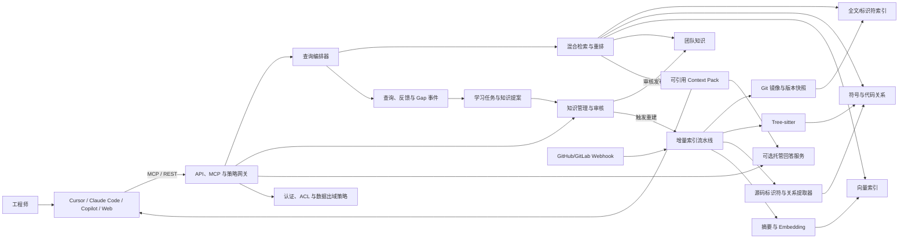

# AIKnowledge 项目总体设计

状态：Draft v0.4<br>
更新日期：2026-08-02<br>
技术落地映射：[技术蓝图](technical-blueprint.md)<br>
执行任务：[具体实施计划](implementation-plan.md)

## 1. 结论先行

这个项目不应该被设计成“把代码切块后放进向量数据库”的普通 RAG。代码问题通常依赖符号定义、调用关系、宏、构建选项、分支和提交版本；单纯语义相似无法稳定回答这些问题。

建议把 AIKnowledge 定义为：

> 一个面向团队的、版本化且可审计的代码上下文平台。它持续索引代码和工程知识，通过混合检索组装可引用的上下文，通过远程 MCP 暴露给各种 AI，并把问题、反馈和代码变更转化为受治理的知识更新。

核心产品是模型无关的“共享上下文基础设施”：负责索引、检索、权限、引用和知识治理，不要求团队统一使用某个模型。同时提供可选的“托管回答服务”，用于 Web/机器人等需要保存最终回答、执行完整评测和形成学习闭环的场景。

第一版采用模块化单体，不做微服务；采用 PostgreSQL + pgvector 作为主数据层，Git 镜像保存原始事实，Tree-sitter + 源码标识符/关系提取器建立无需编译的代码结构，全文/符号/向量/关系混合检索，通过受控的 Streamable HTTP MCP 接入 Cursor、Claude Code、Copilot 等客户端。

最重要的产品规则是：

> 每次提问都应该让系统获得学习信号，但不能让每个 AI 回答自动污染正式知识库。

## 2. 问题定义

### 2.1 要解决的问题

- AI 每次从零读取大型代码仓库，建立上下文慢且不完整。
- 单次会话中得到的结论无法被其他成员复用。
- 代码、设计方案、历史故障和专家经验之间缺少统一检索入口。
- 代码持续变化，旧答案容易在没有提示的情况下失效。
- 不同成员使用 Cursor、Claude Code、Copilot 或其他模型，知识无法跨客户端共享。

### 2.2 第一阶段不做什么

- 不训练自己的基础模型。
- 不替代 GitHub/GitLab、代码评审或 IDE。
- 不允许 AI 在无人审核时把推测写成“已验证知识”。
- 不追求第一版覆盖所有编程语言；先把 C/C++/内核类仓库做深。
- 不在第一版引入独立图数据库、独立搜索集群和 Kubernetes。

## 3. 设计原则

1. **代码事实优先**：源代码、条件表达式、清单和提交历史是一等数据，AI 摘要只是派生数据。
2. **版本化**：任何引用必须包含仓库、commit、路径和行号；不能用“当前最新”代替版本。
3. **多路检索**：标识符/全文、符号关系、语义向量、团队知识分别召回，再统一重排。
4. **来源可追踪**：每条知识记录其来源、生成模型、提示词版本、创建人和审核状态。
5. **安全默认拒绝**：检索权限不得超过用户对源仓库的权限。
6. **读写分离**：查询工具可自动调用；新增、修订和发布知识属于写操作，需要权限和审核。
7. **渐进式复杂度**：PostgreSQL 承担元数据、治理和向量；Zoekt 从结构化检索 PoC 起承担正式代码文本检索。图数据库、专用向量库和 Kubernetes 只在指标证明需要时引入。
8. **外部内容不可信**：代码、文档、Issue、PR 和检索结果都按不可信数据处理，不能改变系统指令或扩大工具权限。
9. **数据出域可控**：仓库访问权限与“允许发送给哪个模型提供商”是两套独立策略，必须同时满足。
10. **范围显式**：每次查询必须解析到明确的 repository/solution snapshot 和可选 workspace overlay；范围不明确时不拼接“各仓最新版本”。
11. **禁止编译依赖**：正式索引只扫描源码，不执行构建，不要求 `.config` 或 compilation database；无法唯一确定的关系必须标记为候选和置信度。

## 4. 总体架构



### 4.1 模块边界

- **Repo Connector**：连接 GitHub/GitLab/本地 Git，维护 bare mirror 和目标分支。
- **Indexer Worker**：直接扫描文件，解析符号、引用候选、调用候选、include、Kconfig/Kbuild 条件和文档；禁止执行构建脚本。
- **Knowledge Service**：管理人工知识、AI 提案、版本、审核和过期状态。
- **Retrieval Service**：理解查询，执行多路召回、融合、重排和上下文预算控制。
- **Policy Service**：执行仓库 ACL、安全域、模型出域策略、数据保留和客户端能力策略。
- **MCP/API Gateway**：提供相互隔离的只读与写入能力，统一认证、限流和审计。
- **Managed Answer Service（可选）**：调用允许的模型生成带引用回答，保存回答用于评测和反馈闭环。
- **Workspace Overlay Service**：把 PR、开发分支或短期本地 diff 叠加到正式 snapshot 上。
- **Web Console**：管理仓库、索引任务、Gap、审核队列、质量指标和权限。

第一版这些模块在一个代码仓库和一个部署单元中实现，索引任务作为独立 worker 进程运行。

## 5. 知识库如何设计

### 5.1 四层知识

| 层级 | 内容 | 是否可直接作为事实 | 更新方式 |
| --- | --- | --- | --- |
| L0 源事实 | Git blob、文件、commit、条件表达式、清单、原始文档 | 是 | Git 同步 |
| L1 分析事实 | 符号、定义/引用、静态调用候选、include、模块关系 | 是“分析器观察结果”，不是运行时真相 | 解析器增量生成 |
| L2 派生知识 | 文件/符号/模块摘要、概念标签、架构关系 | 否，必须保留证据 | AI 生成、自动校验、可审核 |
| L3 团队知识 | 已验证问答、故障案例、ADR、使用约束、专家注释 | 审核后是 | 人工编辑或从提问中提案 |

提问日志、召回结果、反馈和缺口属于学习数据，不直接混入可检索的正式知识。代码内 Markdown 是第一阶段的非代码知识源；ADR、Issue、PR、commit message、故障记录和会议纪要作为后续 connector 接入，并保留原系统身份与权限。

### 5.2 核心实体

- `repository`：仓库、代码托管地址、默认分支、权限映射。
- `snapshot`：仓库在某个 commit 下的不可变索引版本。
- `solution`：一个跨仓方案/产品/子系统的逻辑边界，例如“启动链路”或“存储方案”。
- `solution_snapshot`：该方案在某一时刻所使用的一组仓库 commit、清单和外部依赖版本。
- `solution_member`：方案包含的仓库、目录、模块、角色及版本选择规则。
- `workspace_overlay`：叠加在正式 snapshot 上的 PR、开发分支或短期本地 diff。
- `source_file` / `source_blob`：路径、语言、内容哈希、大小、生成文件标记。
- `symbol_occurrence`：特定 snapshot 中由索引器产生的符号及定义范围。
- `logical_symbol`：跨 commit 尽可能稳定的逻辑实体；与索引器符号 ID 分离。
- `relation`：defines、references、implements、includes、静态调用候选、运行时调用等带来源的边。
- `chunk`：按语法结构切分的可检索片段，不采用固定字符长度粗切。
- `knowledge_item`：摘要、问答、ADR、故障经验或术语解释。
- `knowledge_claim`：知识条目中的一个可独立审核结论，拥有自己的引用和适用范围。
- `citation`：claim 或回答所依赖的 blob、符号/AST anchor、字节范围和展示行号。
- `derived_artifact`：摘要、embedding、关系或 Context Pack 等派生产物及其输入哈希、模型/分析器版本。
- `data_policy`：仓库安全域、允许的模型提供商、日志保留、导出和缓存策略。
- `query_event`：问题、客户端、用户、使用的 snapshot、召回项、耗时和结果。
- `gap`：未覆盖问题、缺失证据、低置信回答或用户纠错。
- `feedback`：接受、拒绝、纠错、补充证据和专家确认。
- `index_job`：索引、重建、失效传播和失败重试记录。

### 5.3 跨仓方案模型

仓库是代码的存储边界，不一定是工程问题的知识边界。系统需要把“方案”建模为高于仓库的一等实体：

```text
Solution: storage-stack
  SolutionSnapshot: release-2026.07
    kernel-repo       @ 8f21...
    driver-repo       @ 19ac...
    firmware-repo     @ 02bd...
    design-docs       @ 771e...
    api-contract      @ v3.4
```

`solution_snapshot` 必须冻结一组彼此兼容的版本，类似软件 BOM。版本组合优先从 release manifest、CI/CD 配置、Git submodule、repo 工具清单或制品元数据自动导入；缺失时才由方案 owner 手工维护。查询“某方案”时默认针对 solution snapshot，而不是把各仓库最新分支随意拼接。

跨仓关系包含：

- 共享头文件、导出符号、接口名称及跨仓定义/引用候选；
- include/import、包依赖、构建依赖、submodule 和 manifest；
- RPC、OpenAPI、Protobuf、消息主题、共享数据结构和配置键；
- 服务调用、驱动—内核—固件边界及生成代码来源；
- ADR、方案文档、Issue/PR 与具体代码变更之间的显式引用；
- 工程师审核后的 `depends_on`、`implements`、`replaces`、`compatible_with` 等人工关系。

跨仓边由“源码直接事实、源码静态推断、接口契约、AI 推断、人工确认”五种来源产生，必须记录来源和置信级别。AI 推断边不能自动升级为代码事实。

物理存储可以继续共用 PostgreSQL 表和向量索引，但每条记录都要包含 `repository_id`、`snapshot_id` 和 ACL；方案只是一层可版本化的查询视图，不能通过建立一个无权限隔离的“大总库”实现。

### 5.4 知识状态机

```text
observed -> proposed -> mechanically_validated -> human_reviewed -> published
              |                  |                    |              |
              +-> rejected       +-> model_checked    +-> rejected   +-> stale -> superseded
```

- `observed`：系统从问题、代码或文档中观察到候选知识。
- `proposed`：AI 或用户形成带引用的知识提案。
- `mechanically_validated`：只保证引用存在、版本一致、格式正确和权限有效，不声称语义正确。
- `model_checked`：可选的第二模型检查，仅作为风险信号，不能替代审核。
- `human_reviewed`：领域 reviewer 对每个 claim 及证据完成审核。
- `published`：审核后的 claim 进入团队默认检索范围；仍保留适用版本和可信度。
- `stale`：引用的代码发生变化，仍可查看但默认降低排序并显示警告。
- `superseded`：新知识替代旧知识，保留审计链。

### 5.5 稳定引用与跨版本身份

行号只用于展示，不能作为引用主键。citation 至少包含：

```text
repository_id + snapshot_id + blob_sha + byte_range
logical_symbol_id? + indexer_symbol_id? + ast_anchor?
display_path + display_lines + source_conditions?
```

代码更新时先通过 blob、逻辑符号和 AST anchor 尝试重新定位；仅移动或格式化成功重定位后不应直接把知识标记为 stale。`logical_symbol_id` 与任一解析器的版本化 symbol 分离，并通过签名、父级符号、路径和 rename/copy 信息做跨 commit 映射。

## 6. 代码扫描与更新流水线

### 6.1 首次索引

1. 以只读凭据克隆 bare mirror，记录目标 commit。
2. 应用包含/排除规则：忽略二进制、构建产物、依赖镜像和超大文件。
3. 识别语言、目录、构建系统、README、设计文档、Kconfig/Makefile 等关键文件。
4. 用 Tree-sitter 生成稳定的语法块和基础符号。
5. 直接扫描标识符、声明、include/import、Kconfig/Kbuild 与调用表达式，以作用域、签名、链接属性和路径生成定义/引用/调用候选。
6. 对函数指针、宏、条件编译和动态注册关系保留候选集合、条件表达式与置信度，不输出虚假的唯一关系。
7. 生成文件级、符号级、模块级摘要；所有 claim 绑定稳定引用和输入 artifact 哈希。
8. 生成 embedding，并写入带 `snapshot_id`、模型版本和安全域的向量记录。
9. 构建全文/标识符索引，发布新的 snapshot；发布过程原子切换。

索引 worker 必须运行在无默认出网、只读源码、限制 CPU/内存/磁盘的沙箱中。不得执行仓库提供的构建脚本、生成器或任意代码；索引输入只来自 Git 对象和静态文件。

内核类仓库不选择并编译某个配置，而是直接把 `#if`、Kconfig 依赖、Kbuild 目录/目标条件保存为关系属性。同一 commit 下可能存在的多个配置视图共用一份源码索引；查询时根据用户给出的架构或配置条件过滤，未提供条件时明确展示歧义和覆盖率。

### 6.2 Git 增量更新

- 由 push/merge webhook 触发，比较 `old_commit..new_commit`。
- 未变化且内容哈希相同的文件、chunk 和 embedding 直接复用。
- 对修改文件重建语法块和符号；派生产物根据记录的输入 artifact 哈希和 provenance DAG 精确失效，不做无边界的调用图扩散。
- 删除项做 tombstone，避免旧向量继续被召回。
- 检查所有 citation；先尝试重新定位，证据语义或适用范围变化后再标记 `stale`。
- 新 snapshot 完整构建并通过检查后再切换，查询始终只看到一致版本。
- 默认保留当前分支、被发布 solution 引用、被知识引用和人工 pinned 的 snapshot；其他索引按策略清理，blob、chunk 和 embedding 按内容哈希去重。

### 6.3 从提问中进化

一次查询可能产生以下信号：

- 搜索无结果或证据覆盖不足：创建 `gap`。
- 用户连续追问或大幅改写：提高 gap 优先级。
- 用户接受并给出补充说明：形成 `knowledge_item` 提案。
- 用户指出错误：降低相关知识可信度，创建修订任务。
- 多人重复询问：提高对应主题的摘要、术语或 FAQ 建设优先级。

学习 worker 对高价值 gap 重新执行更深的符号扩展、全文搜索和代码阅读，形成“带证据的 claim 提案”。提案经过机械校验和人工审核后才发布。这样团队确实会因每次提问而进化，但不会形成 AI 错误相互强化的闭环。

MCP 上下文模式只能可靠记录检索 trace，通常看不到客户端最终答案。完整的回答、引用和追问分析只在托管回答模式中自动完成；上下文模式依靠 `trace_id`、显式反馈和可选客户端扩展回传信号，不能声称每次回答都已被系统观察。

## 7. 查询与回答流程

### 7.1 查询路由

1. 将输入解析成显式 `scope={type: repository|solution, id, revision, source_conditions?}`；缺失或歧义时返回候选范围，不默认拼接最新分支。
2. 如果指定方案，解析对应 `solution_snapshot`，得到一致的仓库与版本集合。
3. 如果存在 `workspace_overlay`，校验其 base snapshot、权限和有效期，并把 PR/分支/本地 diff 置于正式 snapshot 之上。
4. 先做方案级路由：根据术语、接口、模块和关系图选出候选仓库，避免对所有仓库无差别搜索。
5. 若包含精确标识符，优先符号和全文检索。
6. 在候选仓库内并行执行：
   - Zoekt 的全文/正则/标识符检索（ripgrep 仅保留为评测 baseline 和故障诊断工具）；
   - 直接扫描产生的定义、引用候选、include/Kconfig/Kbuild 与调用候选扩展；
   - pgvector 语义检索；
   - 已发布团队知识检索。
7. 沿跨仓关系图做有限深度扩展，例如从 API 声明找到实现仓，再找到调用仓。
8. 使用 Reciprocal Rank Fusion 合并结果，再用 reranker 做跨仓统一排序。
9. 按 token 预算生成 `Context Pack`，包含代码片段、关系、摘要、版本、覆盖率和引用。
10. 上下文模式把 Context Pack 返回客户端；托管回答模式由服务端生成 claim 级引用的答案。
11. 记录检索 trace；仅在得到最终答案或显式反馈时记录回答质量和 gap。

跨仓检索采用“两阶段召回”：先选仓库/模块，再在仓库内部找证据。这样既降低成本，也避免一个大仓库因为相似片段多而淹没较小但关键的接口仓库。

### 7.2 “知识库没有答案”的判断

不能只看向量相似度。建议同时满足以下条件才允许输出确定性答案：

- 有与当前 snapshot 一致的源代码或已发布团队知识；
- 关键实体能被精确定位，或语义结果经过全文/关系结果交叉支持；
- Context Pack 对问题的主要子问题有证据覆盖；
- 引用内容哈希有效，且没有 stale 警告。
- 用户对相关仓库和知识均有权限，且当前模型符合仓库数据出域策略。

否则返回“证据不足”，展示已找到的部分事实，并创建 gap。宁可明确未知，也不要用低置信摘要填空。

### 7.3 Context Pack 建议格式

```json
{
  "query": "原始问题",
  "solution_snapshot": {
    "solution": "storage-stack",
    "version": "release-2026.07",
    "members": [{"repo": "org/kernel", "commit": "abc123", "profile": "x86_defconfig"}]
  },
  "workspace_overlay": {"id": "overlay_123", "base": "release-2026.07", "expires_at": "..."},
  "facts": [{"text": "...", "repo": "org/kernel", "path": "mm/foo.c", "lines": [120, 168]}],
  "symbols": [{"id": "...", "name": "foo", "relations": ["calls:bar"]}],
  "team_knowledge": [{"id": "kb_42", "status": "published", "citations": ["..."]}],
  "coverage": {"complete": false, "partial_visibility": false},
  "gaps": ["缺少 arm64 配置下的证据"],
  "retrieval_trace_id": "trace_..."
}
```

## 8. 多人共同操作

### 8.1 身份和权限

- 使用公司 OIDC/SSO；PoC 可用 GitHub OAuth，内网部署可接 Keycloak/Authentik。
- 权限按 `organization -> team -> repository -> branch` 继承。
- 从 GitHub/GitLab 同步仓库成员权限，服务端在每次召回前做 ACL 过滤。
- `reader` 可查询；`contributor` 可提交知识提案；`reviewer` 可发布；`admin` 管理仓库和策略。
- AI 客户端使用用户授权令牌，不能用一个共享超级 Token 代表所有成员。
- 跨仓查询对每个候选仓库分别做 ACL 判断；无权仓库的名称、片段、摘要和关系都不能泄露。
- 当用户只能看到方案的一部分时，回答必须标记 `partial_visibility`，不能假装已经覆盖完整方案。

### 8.2 协作机制

- 知识条目采用版本号和乐观锁，避免多人覆盖。
- 每个条目显示来源、作者、审核者、变更历史和受影响代码版本。
- 支持评论、建议修改、合并重复条目和指定领域 owner。
- 记录 MCP 工具调用和知识写操作的审计日志。
- 团队首页展示高频 gap、过期知识、索引健康度和待审核提案。

### 8.3 安全与数据治理

- 代码、文档、Issue、PR 和模型输出统一视为不可信内容，用结构化边界传给模型，禁止其中的文本改变系统指令或工具权限。
- `data_policy` 独立于 repository ACL：用户即使能读代码，也只能把代码发送给该仓库批准的本地/云端模型。
- MCP 服务只接受 audience 为自身的令牌，禁止把客户端 token 不校验地透传给下游服务。
- OAuth discovery、webhook 和 repository URL 做 HTTPS、域名/IP allowlist、重定向逐跳校验和 SSRF 防护。
- worker 使用固定镜像、只读源码、临时文件系统、网络策略、资源配额和任务超时。
- 日志默认不保存完整源码和最终 Prompt；问题、片段、回答和 embedding 分别配置保留期限与删除策略。
- 对源码和 Context Pack 做 secret 检测与分类标签；高敏内容禁止进入外部模型和共享缓存。
- 缓存键包含 principal、安全域、权限版本、snapshot、overlay 和模型策略，避免跨用户复用越权结果。
- 定期执行 Prompt Injection、越权检索、恶意仓库、OAuth 和 webhook 对抗测试。

## 9. 如何接入 Cursor、Claude 等 AI

### 9.1 统一协议

采用远程 MCP 的 Streamable HTTP transport。支持 OAuth 2.1/OIDC 的交互式客户端使用用户授权；不支持远程 OAuth 的云端 agent 只能使用管理员配置的短期、只读服务凭据。MCP 是 AIKnowledge 的主要机器接口；同时保留 REST/OpenAPI，供 Web UI、自动化和暂不支持 MCP 的客户端使用。

第一版优先暴露 tools，因为不同客户端对 MCP resources/prompts 的支持并不完全一致。

### 9.2 建议的 MCP Tools

对模型公开的第一版工具保持少而稳定：

- `scope.resolve(query, workspace_hint?)`：返回明确的 repository/solution scope 候选。
- `context.search(scope, question, overlay?, filters?, cursor?)`：搜索并返回精简候选与分页游标。
- `context.get(trace_or_result_id, token_budget?)`：构建有大小上限的 Context Pack。
- `feedback.submit(trace_id, rating, correction?)`：提交显式反馈；根据客户端能力放在独立写端点。

低层的 `find_symbol`、`get_relations`、`get_file`、`knowledge.search` 等能力作为服务端内部 API，后续只有在真实工具选择评测证明有价值时才暴露。

管理和知识写入使用独立 `/mcp/write` 或 Web/REST：

- `gap.report(trace_id, description?)`
- `knowledge.propose(claims, citations, scope)`
- `knowledge.review(item_id, claim_decisions, comment)`

只读服务部署为 `/mcp/read`，写服务部署为 `/mcp/write`。不保证逐次确认的客户端不得配置写服务；发布操作只对 reviewer 开放。所有响应设置条数、单片段字节数、总 token、遍历深度和分页限制。

### 9.3 客户端适配

- **Cursor**：项目或全局 `mcp.json` 指向远程 `/mcp` 地址；官方支持远程 Streamable HTTP 和 OAuth。
- **Claude Code**：使用 `claude mcp` 添加远程服务器，团队范围配置可进入受控项目配置。
- **GitHub Copilot / VS Code**：IDE 可通过 workspace `mcp.json` 接入；Copilot cloud agent 当前不支持远程 OAuth，必须只配置 read tools 和受限服务凭据，并使用企业 allowlist。
- **Continue**：作为开源测试客户端和模型切换层使用，验证 MCP 与不同模型的工具调用质量。
- **其他 AI**：若支持 MCP，直接复用；否则调用 REST `context/build` 获取标准 Context Pack。

客户端只负责选择和调用工具，知识与权限逻辑必须留在服务端，避免不同 IDE 产生不同版本的“事实”。

## 10. 推荐技术栈

| 范围 | MVP 选择 | 原因 | 后续升级条件 |
| --- | --- | --- | --- |
| 后端 | Python 3.12 + FastAPI | AI/解析生态成熟，迭代快 | CPU 热点再用 Go/Rust 拆分 |
| MCP | 官方 MCP Python SDK `mcp==1.28.0` + Streamable HTTP | 锁定已发布稳定线，避免 pre-release 协议变化影响客户端 | v2 GA tag 发布且 Cursor、Claude、VS Code 兼容测试通过后升级 |
| 主数据库 | PostgreSQL 18 当前 minor | 事务、RLS、FTS、JSON、关系表统一 | 明确瓶颈后再拆；17 仍可作为兼容下限 |
| 向量检索 | pgvector + 安全域分区 | 降低组件数，支持 HNSW 和混合检索 | 千万级 chunk 或独立扩缩容时评估 Qdrant |
| 语义模型候选 | Qwen3-Embedding-0.6B + Qwen3-Reranker-0.6B | 可本地部署，覆盖代码和多语言；小模型适合先测成本收益 | 只有黄金集证明增益后进入 MVP；否则保留接口、不启用 |
| 精确检索 | ripgrep 评测 baseline；Zoekt 正式通道 | baseline 简单可复现；Zoekt 面向代码提供 trigram、正则、符号信号和多仓搜索 | Zoekt 无法满足 ACL 后过滤召回或运维要求时重新评估 |
| 语法解析 | Tree-sitter | 多语言、增量、适合结构化切块 | 保持为通用 fallback |
| 源码关系索引 | Tree-sitter + 自研标识符/include/Kconfig/Kbuild 提取器 | 无需编译即可覆盖大仓和快速更新；所有推断关系显式携带置信度 | 黄金集证明需要时增加新的 source-only parser |
| Git 数据 | 本地 bare mirror + 对象存储备份 | commit 可复现，增量 fetch 快 | 多节点时共享对象存储/缓存 |
| 异步任务 | Redis + Dramatiq | 部署简单，支持重试 | 长流程/复杂恢复时评估 Temporal |
| 索引隔离 | 固定容器镜像 + 网络/资源策略 | 源仓库内容不可信 | 高安全环境采用 microVM/独立 worker 池 |
| Web 控制台 | React/Next.js | 管理、审核和可观测性生态成熟 | 无需前期复杂化 |
| 认证 | OIDC；PoC GitHub OAuth | 兼容团队 SSO | 对接公司 IdP 与仓库 ACL |
| 可观测性 | OpenTelemetry + Prometheus/Grafana | 统一追踪检索和索引质量 | 从第一版保留 trace_id |
| 部署 | Docker Compose | 单机可快速验证 | 多团队、高可用后迁移 Kubernetes |

Embedding、reranker 和生成模型通过 provider interface 配置，不写死供应商。Qwen3-Embedding-0.6B 与 Qwen3-Reranker-0.6B 只是首轮本地候选，必须先用真实内核问题证明质量收益；模型更换时通过 `model_id + dimension + version` 并行重建索引，禁止原地混用不同 embedding。首版依赖显式锁定 `mcp==1.28.0`；只有 MCP v2 发布 GA tag 且 Cursor、Claude、VS Code 兼容矩阵验证通过后才升级。

## 11. 可复用的开源项目

| 项目 | 对应组件 | 复用方式 | MVP 决策 |
| --- | --- | --- | --- |
| [Tree-sitter](https://github.com/tree-sitter/tree-sitter) | C3 Code Intelligence | 结构化 chunk、定义/声明/调用表达式与条件节点 | 直接依赖 |
| SCIP | C3 可选互操作 | 仅参考定义/引用/实现的数据语义；未来可导出 source-only 结果 | 不进入首版运行依赖 |
| scip-clang | C3 对照方案 | 记录其编译数据库依赖与精度边界 | 与“禁止依赖编译”的约束冲突，不采用 |
| [Zoekt](https://github.com/sourcegraph/zoekt) | C4 Lexical Search、C7 Retrieval | 建正式 trigram 代码索引，通过内部 JSON/gRPC adapter 查询 | Phase 0B 直接依赖；不承担权限和知识治理 |
| [pgvector](https://github.com/pgvector/pgvector) | C5 Semantic Index、C6 Store | 保存 embedding 并参与混合检索 | 直接依赖 |
| [Qwen3 Embedding](https://github.com/QwenLM/Qwen3-Embedding) | C5 Semantic Index | 0.6B embedding/reranker 作为本地评测候选 | 条件依赖；黄金集达标后启用 |
| [MCP SDK](https://github.com/modelcontextprotocol/python-sdk) | C9 MCP Gateway | 实现标准 tools/resources 和 Streamable HTTP | 直接依赖，首版锁定 `1.28.0` |
| [Keycloak](https://www.keycloak.org/) | C10 Identity/Policy | 没有企业 IdP 时提供 OIDC 测试与试点身份源 | 条件依赖；不替代仓库 ACL |
| [Tabby](https://github.com/TabbyML/tabby) | 产品参考 | 比较 Answer Engine 和仓库上下文体验 | 仅参考/对照，不 fork、不作为运行依赖 |
| [Continue](https://github.com/continuedev/continue) | 客户端验证 | 验证不同模型和 MCP 调用 | 仅测试客户端 |
| [OpenGrok](https://github.com/oracle/opengrok) | 搜索对照 | 作为源码搜索质量基准 | 仅备选，不进入首版运行时 |
| [Microsoft GraphRAG](https://github.com/microsoft/graphrag) | 后期文档研究 | 评估设计文档的主题与实体关系 | Phase 2 后研究；不生成代码调用关系 |

Sourcegraph 完整平台是重要产品参考，但不作为基础平台；首版只复用符合直接扫描约束的 Tree-sitter 与 Zoekt，代码关系模型由项目自行实现。

## 12. 分阶段实施

### Phase 0A：评测基线

- 选择一个真实 C/C++ 或内核仓库和一个固定 commit；不准备构建环境。
- 收集 30～50 个历史真实问题，标注关键文件、符号、版本和“无法回答”负样本。
- 用 ripgrep/全文搜索建立最小 lexical baseline，不接 AI 客户端、不生成团队知识。

退出标准：评测数据可复现，标注经过至少一名领域工程师复核，baseline 指标可自动运行。

### Phase 0B：结构化检索 PoC

- 加入 Tree-sitter、源码标识符/关系提取器、Zoekt、pgvector 和稳定 citation。
- 比较 lexical、纯向量、lexical+向量、lexical+向量+符号四组方案。
- 输出只读 Context Pack 和完整 retrieval trace。

建议门槛：Evidence Recall@10 不低于 0.85；Version Accuracy 为 1.0；负样本中错误确定性回答率低于 10%；相对 lexical baseline 的 Recall@10 提升至少 15%。最终阈值在看过首批标注分布后冻结。

### Phase 0C：跨仓方案 PoC

- 手工定义一个 solution snapshot，包含 2～4 个仓库及固定版本。
- 增加至少 10 个跨仓问题，验证两阶段路由、跨仓引用和版本一致性。
- 验证一个仓库不可见时的 `partial_visibility` 行为。

### Phase 1A：只读 MCP MVP

- 发布 `/mcp/read`，接入 Cursor 和 Claude Code。
- 提供 scope resolve、context search/get、trace 和严格输出预算。
- 支持固定 snapshot、手工 solution snapshot 和可选的源码条件过滤。

### Phase 1B：团队安全试点

- OIDC、repository ACL、PostgreSQL RLS、安全域分区、数据出域策略和审计。
- Git webhook 增量索引、provenance 失效、原子发布和 snapshot 保留策略。
- 完成 Prompt Injection、越权检索、恶意仓库和 OAuth 威胁测试。

### Phase 1C：知识进化闭环

- feedback、gap、claim 提案、机械校验、人工审核和 stale/re-anchor 流程。
- 最小 Web 页面展示查询 trace、待审核 claim、高频 gap 和索引健康度。
- 托管回答服务用于保存最终回答并评测 groundedness；MCP 上下文模式只记录可观察信号。

### Phase 2：开发态与自动化

- PR、开发分支和短期本地 diff 的 workspace overlay。
- 从 release manifest/CI/BOM 自动生成 solution snapshot。
- ADR、PR、Issue、commit message 和故障记录 connector。
- 扩展 Zoekt 分片与索引调度；根据指标决定是否启用 reranker、更多语言索引器或专用向量库。

### Phase 3：规模化

- 多节点 worker、索引分片、冷热 snapshot、对象存储和灾难恢复。
- 更多 source-only 语言解析器、跨仓依赖图和运行时 evidence。
- 企业 SSO、审计导出、数据保留、合规策略和安全域隔离部署。

## 13. 质量指标

不能只统计“回答次数”或点赞率，至少跟踪：

- **Evidence Recall@K**：标准问题所需的关键代码是否进入 Context Pack。
- **Citation Precision**：托管回答或已回传回答中的引用是否真正支持对应 claim。
- **Version Accuracy**：回答使用的 repository/solution commit 集合是否正确。
- **Grounded Answer Rate**：仅对系统能观察到最终回答的托管/回传模式计算。
- **Unknown Precision**：证据不足时是否正确选择不确定，而非编造。
- **Gap Closure Time**：高频 gap 从发现到发布知识的时间。
- **Freshness Lag**：代码合并到新 snapshot 可查询的延迟。
- **Stale Leakage**：过期知识在无警告情况下被用于回答的比例。
- **Retrieval P95** 与完整回答 P95。
- **Team Reuse**：同一知识被不同成员和不同客户端有效使用的次数。
- **ACL Isolation**：越权测试中跨安全域泄露必须为零。
- **Overlay Accuracy**：开发态回答是否正确优先使用 overlay 而非旧 snapshot。

评测集要包含：精确符号定位、调用链、配置差异、设计原因、历史故障、跨仓依赖以及“仓库中无法回答”的负样本。

## 14. 主要风险与应对

| 风险 | 应对 |
| --- | --- |
| AI 生成摘要污染知识 | 提案/发布分离；来源、审核和 stale 状态强制存在 |
| 代码变更后引用失效 | commit 固定、内容哈希校验、增量失效传播 |
| C/C++ 宏和条件编译导致关系不唯一 | 静态解析条件表达式，保存候选集合、来源、置信度和覆盖率；不编译单一配置来掩盖歧义 |
| source-only 分析无法提供完整调用图 | 独立提取调用候选并记录来源/置信度；动态关系不冒充静态事实 |
| 跨仓回答混用了不兼容版本 | 以 solution snapshot 冻结版本集合；无一致版本时显式拒绝确定性回答 |
| 大仓库结果淹没关键小仓库 | 先做方案级仓库路由，再分仓召回和跨仓统一重排 |
| 私有代码越权或发送给未批准模型 | 用户级认证、数据库 RLS、安全域分区、数据出域策略、缓存隔离和审计 |
| 仓库内容触发 Prompt Injection | 内容按不可信数据隔离；工具最小权限；高风险写操作不向不支持确认的客户端开放 |
| 恶意仓库内容攻击索引器 | 固定镜像、只读沙箱、默认禁网、绝不执行仓库脚本并限制资源 |
| MCP 客户端认证能力不一致 | read/write 端点分离；兼容矩阵；云端 agent 使用只读短期凭据 |
| 客户端生成的最终答案不可见 | 上下文模式只评测检索；托管/回传模式承担回答评测与学习闭环 |
| 开发分支与本地修改未进入知识库 | workspace overlay 叠加在固定 base snapshot 上并短期保存 |
| 组件过多导致项目无法落地 | 模块化单体 + PostgreSQL 起步，Zoekt/图数据库延后 |
| 不同 AI 客户端行为不一致 | MCP tools 设计为窄接口，服务端输出确定性的 Context Pack |
| 大模型擅自写入知识 | 只读和写工具分离，写入确认，发布需 reviewer |
| 评测被“看起来不错”误导 | 使用历史真实问题、关键证据标注和负样本持续回归 |

## 15. 建议的仓库结构

```text
AIKnowledge/
  apps/
    api/                 # REST + MCP gateway
    web/                 # 管理与审核 UI
    worker/              # 索引和学习任务
    answer/              # 可选托管回答服务
  packages/
    domain/              # 核心实体与状态机
    connectors/          # GitHub/GitLab/Git
    indexers/            # tree-sitter/source relation adapters
    retrieval/           # hybrid retrieval/rerank/context pack
    auth/                # OIDC + ACL
    policy/              # 数据出域、保留、客户端能力策略
    overlays/            # PR/branch/local diff overlay
  migrations/
  deploy/
    compose.yaml
  docs/
    architecture.md
    adr/
  tests/
    golden/              # 真实问题、期望证据和负样本
    security/            # ACL、Prompt Injection、恶意仓库与 OAuth 测试
  evals/                 # 离线检索与回答评测入口
```

## 16. 下一步

当前已经完成固定版本、ripgrep baseline、Tree-sitter、source-only 关系、blob 分析缓存和一层有界依赖扩展。下一步先定义 Context Pack v1 与 retrieval trace 的稳定契约，再让 Zoekt、symbol/vector 通道和跨仓路由作为可替换召回器接入；这样 AI 客户端不依赖底层索引实现。问题集按当前决定暂时保留但暂停复核，等 Context Pack 可运行后恢复 Evidence Recall@K 对比。架构约束见 [ADR-0001](decisions/0001-source-only-indexing.md)，组件映射和任务见技术蓝图及实施计划。

## 17. 调研依据

- MCP 官方将 tools 定义为可由模型发现和调用的能力，并建议对工具调用保留人工控制：[MCP Tools specification](https://modelcontextprotocol.io/specification/2025-06-18/server/tools)
- MCP HTTP 授权基于 OAuth 2.1 和 Protected Resource Metadata：[MCP Authorization](https://modelcontextprotocol.io/docs/tutorials/security/authorization)
- MCP 官方安全指南覆盖 confused deputy、token passthrough、SSRF 和 session hijacking：[MCP Security Best Practices](https://modelcontextprotocol.io/docs/tutorials/security/security_best_practices)
- Cursor 支持 stdio、SSE、Streamable HTTP，并将远程 HTTP 定位为多人部署方式：[Cursor MCP documentation](https://docs.cursor.com/context/model-context-protocol)
- Claude Code CLI 提供 `claude mcp` 管理 MCP 服务：[Claude Code CLI reference](https://docs.anthropic.com/en/docs/claude-code/cli-usage)
- GitHub Copilot cloud agent 只支持 MCP tools，当前不支持使用 OAuth 的远程 MCP，并会自主调用已配置工具：[GitHub Copilot MCP](https://docs.github.com/en/copilot/concepts/agents/cloud-agent/mcp-and-cloud-agent)
- SCIP/scip-clang 仅作为调研对照；因 scip-clang 依赖 compilation database，不进入首版运行架构。
- Tree-sitter 是增量解析系统，适合多语言语法结构提取：[Tree-sitter](https://github.com/tree-sitter/tree-sitter)
- pgvector 官方支持 HNSW，并建议结合 PostgreSQL FTS、RRF 或 cross-encoder 实现混合检索：[pgvector](https://github.com/pgvector/pgvector)
- pgvector 的近似索引会在扫描后应用过滤，多租户共享索引会影响召回与性能，需分区或隔离：[pgvector Filtering and Multitenancy](https://github.com/pgvector/pgvector#filtering)
- Tabby 已包含自托管、仓库上下文、团队能力和面向内部研发的 Answer Engine，可作为产品基线：[Tabby](https://github.com/TabbyML/tabby)
- OpenGrok 提供源码搜索、交叉引用和版本历史导航：[OpenGrok](https://github.com/oracle/opengrok)
- GraphRAG 明确提示索引成本较高，适合在验证需求后选择性采用：[Microsoft GraphRAG](https://github.com/microsoft/graphrag)
- MCP Python SDK 的 `2.0.0rc1` 仍标记为 pre-release；首版锁定 `1.28.0` 并使用 Streamable HTTP：[MCP Python SDK releases](https://github.com/modelcontextprotocol/python-sdk/releases)
- Qwen3 Embedding/Reranker 提供面向文本与代码检索的多尺寸模型，首轮评测使用 0.6B 候选：[Qwen3-Embedding](https://github.com/QwenLM/Qwen3-Embedding)
- OWASP 将外部文件引发的间接 Prompt Injection 作为独立风险，RAG 本身不能完全缓解：[OWASP LLM01](https://genai.owasp.org/llmrisk/llm01-prompt-injection/)
- PostgreSQL 18 是当前稳定主版本，17 仍在支持周期内：[PostgreSQL Versioning Policy](https://www.postgresql.org/support/versioning/)
