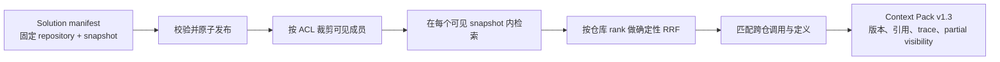

# 跨仓 solution snapshot

## 解决的问题

一个工程方案通常同时依赖内核、驱动、固件或用户态仓库。分别查询每个仓库的“当前最新版”会把不兼容版本混在同一答案里。AIKnowledge 因此把跨仓查询的基本单位定义为不可变 `solution snapshot`：manifest 明确列出每个 repository 对应的精确 snapshot，查询只能在这组版本中进行。

整个流程仍是 source-only。发布 solution 不重新扫描源码，不执行仓库脚本，也不编译任何目标仓库。



## 数据模型

SQLite catalog schema v6 和 PostgreSQL migration `0003_solution_snapshot` 增加四张表：

| 表 | 作用 |
| --- | --- |
| `solution` | 方案的稳定身份和说明 |
| `solution_snapshot` | 不可变 manifest、revision、digest 和发布状态 |
| `solution_snapshot_member` | repository、精确 repository snapshot、role、顺序和 required 标记 |
| `solution_snapshot_event` | `building -> validated -> active -> superseded` 审计事件 |

每个 solution 最多只有一个 active solution snapshot。成员仓库后来产生新的 active snapshot，不会改变已经发布的 solution snapshot。相同 manifest 重复发布是幂等的；历史 solution snapshot 可以原子重新激活，且会留下事件记录。

manifest 使用 JSON，示例见 [`configs/solutions/example.json`](../configs/solutions/example.json)。成员至少两个，repository、snapshot、role 必须各自唯一。`manifest_json` 和 SHA-256 digest 一起保存，避免只保存摘要却无法审计原始版本组合。

## 检索与跨仓关系

当前 PoC 面向 2～4 个仓库，使用保守的两阶段流程：

1. scope resolver 先用 solution manifest 和调用者可见仓库集合确定允许查询的精确 snapshots；它不会回退到 repository 的 active latest。
2. 每个可见 snapshot 独立执行 lexical、symbol、relation hybrid retrieval，然后用 `k=60` 的 repository-rank RRF 公平合并。这样大仓库不会直接淹没小仓库，也不会因早期选择错误丢掉整个仓库。

这是高召回的路由基线。仓库数增长后，可以在第一阶段加入 manifest role、路径和已发布知识驱动的选择器，但必须与当前 all-visible baseline 对比，不能以降低跨仓 Recall 为代价换取速度。

Context Pack v1.3 新增：

- `scope.kind=solution_snapshot`、solution revision 和 manifest digest；
- 每个可见成员的 repository、精确 snapshot、role 和 ordinal；
- `retrieval_trace.routing=all_visible_solution_members`；
- `solution_rrf` 最终排序通道，同时保留仓内 lexical/symbol/relation 贡献；
- `cross_repository_links`：当一个仓库的源码关系以符号文本指向另一个仓库中的定义时，输出带两端 citation 的 `source_inferred` 跨仓链接；
- `partial_visibility`、通用 gap 和 warning。

跨仓链接不会伪装成编译器确认的唯一调用边。它只在同一个固定 solution snapshot、当前可见仓库集合中，把源码调用候选与另一仓的定义匹配，并保留 `source_inferred` 置信度。

## 本地使用

先分别运行 `kb-ingest`，取得每个仓库返回的精确 `snapshot_id`，再复制并修改示例 manifest：

```powershell
python -m aikb kb-solution-publish `
  --db .aikb/catalog.db `
  --manifest configs/solutions/my-solution.json

python -m aikb kb-solution-show `
  --db .aikb/catalog.db `
  --solution my-solution

python -m aikb kb-solution-context `
  --db .aikb/catalog.db `
  --solution my-solution `
  --query "platform_probe 如何进入内核核心路径"
```

PoC 的 `--allow-repository` 是 ACL test double，可重复传入。它只允许列出的仓库进入 resolver 和检索：

```powershell
python -m aikb kb-solution-context `
  --solution my-solution `
  --allow-repository linux-kernel `
  --query "core_ready"
```

返回包会标记 `partial_visibility=true`，但不会列出隐藏仓库的名称、snapshot、正文、symbol、关系或候选统计；完整 solution snapshot ID 和 manifest digest 也会从部分可见输出中移除。生产环境不能信任客户端自行传入该参数；Phase 1B 会由 OIDC、repository ACL 和 PostgreSQL RLS 生成允许集合。

## 发布到 PostgreSQL

先用 `kb-publish-postgres --snapshot-id ...` 把 manifest 的每个 repository snapshot 发布到团队主库，再发布版本组合：

```powershell
python -m aikb kb-solution-publish-postgres `
  --manifest configs/solutions/my-solution.json
```

`PostgresSolutionPublisher` 使用按 solution 名称计算的 transaction advisory lock，在单一事务中校验成员、写入 manifest、记录状态事件并切换 active solution snapshot。`resolve_postgres_solution_scope` 可以把同一个固定 scope 交给 `PostgresCatalog` 和跨仓 Context Pack builder。

## 自动验证结果

`tests/test_solution.py` 的双仓 source-only fixture 覆盖 10 个初始化、请求、完成、中止与恢复类跨仓问题：

- 10/10 问题的 Top-10 结果同时路由到两个预期仓库，repository routing recall = `1.0`；
- 所有返回 evidence 均属于 manifest 固定 snapshots，version combination accuracy = `1.0`；
- repository 出现新 active snapshot 后，旧 solution 仍只查询原固定版本；
- manifest 重复发布、版本切换和历史重新激活均通过；
- 隐藏一个仓库后，序列化的 scope、evidence、symbol、跨仓 link 和 trace 中均不出现其名称、snapshot 或源码标识符。

PostgreSQL 端到端用例已在 GitHub Actions 的 PostgreSQL 17 + pgvector 服务中执行 migration、双仓 snapshot 发布、solution 发布、跨仓 Context Pack 和 partial visibility 验证；43/43 测试通过，见 [run 31043795023](https://github.com/chenkaiyang72-code/AIKnowledge/actions/runs/31043795023)。本地未安装 PostgreSQL 时该用例按设计跳过。

## 当前边界

- PoC visibility 过滤已经证明 builder 不查询或输出隐藏成员，但正式身份认证、ACL 同步和 RLS 尚未实现。
- 当前仓库路由为 2～4 仓高召回基线；尚未为几十或几百仓实现选择性路由与性能基准。
- 跨仓链接只覆盖查询命中的源码符号关系；manifest、IDL、API schema 和外部 symbol map 的离线跨仓边仍待扩展。
- 自动 fixture 证明工程契约，不替代团队真实跨仓问题的人工黄金证据复核。
