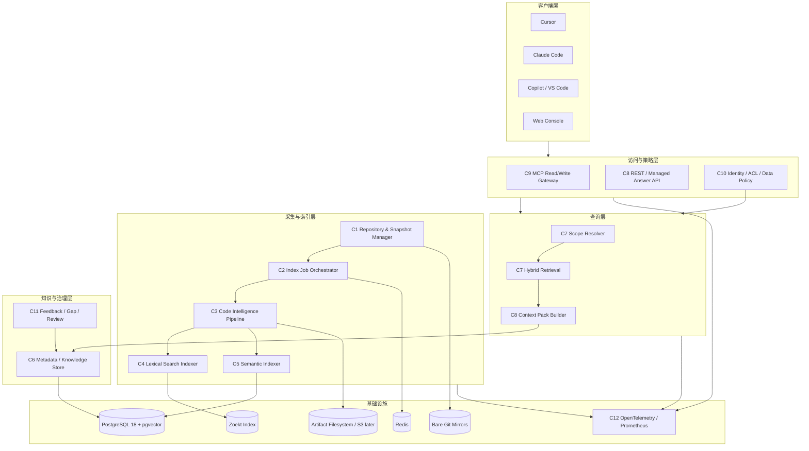

# AIKnowledge 技术蓝图

状态：Draft v0.2<br>
更新日期：2026-08-02<br>
上层设计：[项目总体设计](architecture.md)<br>
执行计划：[具体实施计划](implementation-plan.md)

## 1. 这份蓝图解决什么问题

总体设计解释“系统应该是什么”，实施计划解释“有哪些任务”。本蓝图负责把两者连接起来：

```text
产品能力 -> 架构组件 -> 自研内容 -> 复用项目 -> 具体技术 -> 工作项 -> 验收指标
```

首版不是把 Tabby、OpenGrok、GraphRAG 等项目拼在一起，而是只复用边界清晰的底层组件，自研与团队知识治理有关的核心逻辑。

最终技术路线是：

> Python 模块化单体 + 独立索引 worker + PostgreSQL/pgvector + Git mirror + Tree-sitter + source-only relation index + Zoekt + MCP read gateway。

强制约束：索引不执行编译，不依赖 `.config` 或 compilation database，详见 [ADR-0001](decisions/0001-source-only-indexing.md)。

## 2. 系统分层



部署上仍是模块化单体：`api`、`worker` 和 `web` 来自同一个代码库、共享 domain package，但以不同进程运行。Zoekt、PostgreSQL 和 Redis 是独立容器。这样保留清晰边界，又避免第一版拆成十几个微服务。

## 3. 组件逐项设计

### C1 Repository & Snapshot Manager

**职责**

- 注册 GitHub/GitLab/本地 Git 仓库。
- 以只读凭据维护 bare mirror。
- 将 branch/tag/release 解析为不可变 commit。
- 创建 repository snapshot、solution snapshot 和后续 workspace overlay。
- 接收经过签名验证的 webhook，并产生索引任务。

**怎么做**

1. 服务端只保存仓库 URL 的标准化形式和凭据引用，不保存明文 token。
2. 使用系统 Git CLI 的固定参数模板执行 `clone --mirror`、`fetch --prune` 和 `cat-file`。
3. 禁止将用户输入直接拼接到 shell；仓库 URL 必须通过 host allowlist。
4. snapshot 发布前固定 commit SHA；后续查询不再依赖可移动 branch 名称。
5. Git 对象保存在本地持久卷，PostgreSQL 只保存元数据和对象哈希。

**技术与复用**

| 选择 | 用途 | 为什么 |
| --- | --- | --- |
| Git CLI | mirror、fetch、对象读取 | 最完整地兼容 Git 协议、对象共享和大仓库行为，比自行实现 Git 更可靠 |
| FastAPI service | 仓库注册、webhook、snapshot API | 与其余 Python domain 层统一，开发快 |
| PostgreSQL | repository/snapshot/solution 元数据 | 需要事务和唯一约束，确保 snapshot 原子发布 |

**不复用什么**

- 不直接复用 Tabby 的 repository 管理内部实现，避免绑定其产品模型和升级节奏。
- 不让 Zoekt 的 indexserver 直接持有代码托管超级凭据；AIKnowledge 自己控制同步和 ACL，Zoekt 只接收已批准的本地快照。

**输出**：`RepositorySnapshotReady(repo_id, commit_sha, source_manifest_digest)`。

**对应任务**：GIT-001、GIT-002、SOL-001、SOL-002。

### C2 Index Job Orchestrator

**职责**

- 把一次 snapshot 构建拆成 clone/fetch、文件发现、源码解析、关系提取、lexical、embedding、验证和发布步骤。
- 提供幂等、重试、取消、超时、进度和失败诊断。
- 记录每个派生产物的输入哈希与生成器版本。

**怎么做**

- API 写入 `index_job` 和 outbox，同一事务内产生任务。
- Dramatiq worker 从 Redis 取任务；每个步骤使用 `(snapshot, step, input_hash)` 作为幂等键。
- 解析任务运行在固定容器镜像中，源码只读、默认禁网并限制资源；禁止执行仓库代码和构建脚本。
- 发布采用两阶段状态：`building -> validated -> active`；失败 snapshot 不进入查询。

**技术与复用**

| 选择 | 优势 | 为什么不选替代方案 |
| --- | --- | --- |
| Dramatiq + Redis | Python 集成简单，支持重试、中间件和独立 worker | 第一版流程还不值得引入 Temporal 的运维成本 |
| PostgreSQL outbox | 避免数据库已提交但任务未发送 | 比直接在请求里发 Redis 消息可靠 |
| Docker/容器隔离 | 固定解析器版本、限制恶意仓库 | 直接在 API 进程解析不可信内容风险过高 |

**升级条件**：任务跨天、补偿逻辑复杂或多数据中心时，再评估 Temporal。

**对应任务**：IDX-001、OPS-001、SEC-003、DATA-004。

### C3 Code Intelligence Pipeline

**职责**

- 识别文件语言并按语法节点切块。
- 提取符号、定义、引用、实现、include/import、宏和静态调用候选。
- 建立稳定 citation 和跨 commit logical symbol 映射。
- 保存解析器版本、条件表达式与分析覆盖率。

**实现链路**

```text
source files
  -> Tree-sitter AST/chunks
  -> identifier/definition/declaration occurrences
  -> include/import + Kconfig/Kbuild condition graph
  -> AST call/registration candidates
  -> logical symbol/citation resolver
  -> derived artifacts with provenance
```

**技术与直接复用**

| 开源技术 | 直接承担的工作 | 优势 | 边界 |
| --- | --- | --- | --- |
| [Tree-sitter](https://github.com/tree-sitter/tree-sitter) | C/C++ 语法树、函数/类型边界、结构化 chunk、调用表达式 | 快、容错、增量、多语言 | 不做完整类型解析，不声称能准确解析宏和动态调用 |
| [Zoekt](https://github.com/sourcegraph/zoekt) | 标识符、路径、正则和跨仓文本候选召回 | 直接索引源码，适合大仓和快速查询 | 不负责语义绑定与调用图 |

**必须自研**

- `symbol_occurrence -> logical_symbol` 跨版本映射。
- AST call expression、作用域、签名和标识符 occurrence 的候选绑定算法。
- citation 的 blob/byte range/AST anchor 与 re-anchor。
- Kconfig/Makefile/预处理条件建模。

**调用图策略**

- Phase 0 只生成 `static_call_candidate`，带 `source` 和 `confidence`。
- 直接调用可由 AST、作用域和唯一签名候选较高置信解析。
- 函数指针、宏、回调注册只保存候选，不输出“完整调用链”。
- 关系统一分为 `source_exact`、`source_inferred`、`ambiguous_candidate` 和 `human_verified`；查询必须暴露来源和置信度。

**对应任务**：IDX-002～IDX-005、DATA-002、DATA-003、RET-005。

### C4 Lexical Search

**职责**

- 支持符号名、错误码、宏、字符串、正则和路径搜索。
- 在多仓库中提供高速、可解释的第一路召回。

**分阶段技术**

| 阶段 | 技术 | 用法 | 原因 |
| --- | --- | --- | --- |
| Phase 0A | ripgrep | 直接搜索固定 checkout | 零服务成本，建立必须击败的 baseline |
| Phase 0B 起 | [Zoekt](https://github.com/sourcegraph/zoekt) | `zoekt-git-index` 构建本地索引，`zoekt-webserver` JSON/gRPC API 查询 | trigram 索引适合代码子串/正则；支持跨仓、符号信号和 BM25 |
| 辅助 | PostgreSQL `pg_trgm`/FTS | 搜知识标题、术语、短文本元数据 | 与事务数据共存，适合知识而不是大规模源码正文 |

**部署约束**

- Zoekt 只在内部网络监听，不对用户直接暴露。
- AIKnowledge 在调用 Zoekt 前完成 scope/ACL 过滤，只允许查询获批 repo snapshot。
- 不让 Zoekt 自己决定用户权限；所有结果返回后再次校验 repository/snapshot。

**为什么不选 OpenGrok**

OpenGrok 很适合独立源码浏览器和交叉引用，但本项目需要的是可嵌入、可与自研关系模型融合的检索 API。Zoekt 的索引和 API 边界更适合做内部召回服务；OpenGrok 保留为效果对照，不进入首版运行依赖。

**对应任务**：RET-001、RET-003、RET-006。

### C5 Semantic Indexer

**职责**

- 为语法 chunk、已发布 knowledge claim 和设计文档生成 embedding。
- 支持中文问题检索英文注释、代码和混合文本。
- 对多路召回的候选进行语义 rerank。

**首选候选技术**

| 组件 | PoC 选择 | 原因 |
| --- | --- | --- |
| Embedding | [Qwen3-Embedding-0.6B](https://github.com/QwenLM/Qwen3-Embedding) | 1024 维、0.6B、支持中文/英文/多种编程语言和代码检索，适合本地验证 |
| Reranker | Qwen3-Reranker-0.6B | 与 embedding 同系列，官方提供代码检索评测，资源需求低于 4B/8B |
| 推理 | PoC 使用 Transformers 独立 worker | 与官方示例一致，先测质量和吞吐；不提前引入推理服务 |
| 存储 | PostgreSQL + pgvector HNSW | embedding 与 ACL/snapshot 元数据同库，事务和过滤方便 |

这些是“默认评测候选”，不是不可替换依赖。Phase 0B 必须与纯 lexical 和无 reranker 方案对照；达不到收益就不进入 MVP。

**实现规则**

- query 使用明确英文 instruction，document 不附 instruction，保持与模型建议一致。
- 所有向量记录 `model_id`、revision、dimension、instruction_version 和 content_hash。
- 模型切换建立新列/新表并双写重建，不混用不同 embedding 空间。
- 向量表按安全域分区，查询在数据库层带 repository/snapshot 条件。
- 不对整文件盲目 embedding，只处理语法 chunk、接口说明和已发布 claim。

**对应任务**：RET-003、RET-004、EVAL-006、ADR-001。

### C6 Metadata & Knowledge Store

**职责**

- 保存 repository/snapshot/solution、符号关系、citation、provenance、knowledge claim、feedback、gap、ACL 和审计。
- 提供原子 snapshot 发布、知识状态机和行级安全。

**技术选择**

| 技术 | 用途 | 优势 |
| --- | --- | --- |
| PostgreSQL 18 | 事务元数据、关系边、知识和审计 | 单一可信数据源、约束强、支持 JSONB/RLS/分区 |
| pgvector | 语义向量 | 减少组件数量，能与 repository/snapshot 条件联查 |
| SQLAlchemy 2 + Alembic | Python 数据访问和 migration | 显式 schema、测试和升级路径成熟 |

**为什么暂不使用 Neo4j/GraphRAG**

- 代码关系首先来自源码 AST、标识符、include 和配置条件；推断边携带置信度，不需要 LLM 抽取代码事实图。
- Phase 0 的关系深度有限，PostgreSQL 邻接表和递归 CTE 足够。
- 只有图遍历成为已测量瓶颈、或非代码文档需要全局主题图时，再评估图数据库/GraphRAG。

**物理数据分工**

```text
Git mirror       -> 原始 Git 对象和 commit
Artifact volume  -> 解析/关系中间产物、评测报告
Zoekt volume     -> lexical index
PostgreSQL       -> 可查询元数据、关系、知识、向量、权限、审计
Redis            -> 短期任务队列和非权威缓存
```

**对应任务**：DATA-001～DATA-004、KB-001、AUTH-004。

### C7 Scope Resolver & Hybrid Retrieval

**职责**

- 将问题解析为唯一 repository/solution snapshot 和可选 overlay。
- 执行 lexical、symbol、vector、knowledge 四路召回。
- 沿有限深度关系扩展，融合、重排并控制证据预算。

**为什么自研而不直接上 LangChain/LlamaIndex**

- ACL、snapshot、source conditions 和 citation 是查询正确性的核心，必须显式存在于每一步。
- 通用 RAG 框架容易隐藏过滤、chunk 和引用细节，调试失败召回困难。
- 首版检索编排代码量可控：adapter + RRF + policy filter + context budget。

后续可复用通用框架的模型客户端或评测工具，但不让其拥有核心数据模型和授权决策。

**查询算法 v1**

```text
1. resolve scope
2. lexical top 50 from Zoekt
3. symbol/relationship top 30 from PostgreSQL
4. vector top 50 from pgvector
5. repository-level normalization
6. RRF merge to top 40
7. optional reranker to top 15
8. ACL and citation validation
9. token-budget packing
10. return Context Pack + retrieval trace
```

ACL 在每一路召回前和最终输出前都执行。不得先搜索所有私有仓库再在应用层简单删除结果。

**对应任务**：RET-003～RET-006、SOL-004、SOL-005、CTX-001、TRACE-001。

### C8 Context Pack & Optional Managed Answer

**职责**

- 把检索结果转换为不同 AI 都能使用的稳定结构。
- 限制 token/字节/条目/关系深度。
- 可选地由服务端调用批准的模型生成带 claim 引用的回答。

**技术选择**

- Pydantic v2 定义 Context Pack versioned schema。
- FastAPI 提供 REST；模型 provider 使用内部接口，不在 domain 层绑定 OpenAI/Anthropic。
- 托管回答只支持仓库 `data_policy` 批准的 provider；本地模型可通过 OpenAI-compatible endpoint 接入。
- Context Pack 是首要产品，托管回答是可选消费者，二者不能反向耦合。

**对应任务**：CTX-001、ANS-001、EVAL-009。

### C9 MCP Gateway

**职责**

- 将 scope/context/feedback 能力暴露给 Cursor、Claude Code、Copilot/VS Code。
- 分离 `/mcp/read` 与 `/mcp/write`。
- 对不同客户端执行能力、认证和输出限制。

**具体版本决策**

- 首个实现锁定 `mcp==1.28.0`。截至本蓝图更新时，官方 release 页面最新 v2 仍是 `2.0.0rc1`，不能把候选版作为团队 MVP 基线。
- 创建 MCP v2 compatibility test 分支；等 `2.0.0` 正式 tag 发布且 Cursor、Claude Code、VS Code/Copilot 三类客户端通过互操作测试后再迁移。
- 使用 stateless Streamable HTTP；反向代理负责 TLS 和请求体限制。

**第一版公开工具**

- `scope.resolve`
- `context.search`
- `context.get`
- `feedback.submit`（只在支持用户确认的写端点）

**直接复用**：[MCP Python SDK](https://github.com/modelcontextprotocol/python-sdk) 负责协议、schema 和 transport；AIKnowledge 自研 tool 语义、认证、ACL、审计和客户端策略。

**客户端复用定位**

- [Continue](https://github.com/continuedev/continue)：作为开源测试客户端和模型切换实验工具，不进入服务端依赖。
- Cursor、Claude Code、VS Code：真实兼容性验收客户端。

**对应任务**：MCP-001～MCP-005、INT-001、INT-002。

### C10 Identity, ACL & Data Policy

**职责**

- 验证用户/服务身份。
- 将身份映射到 repository/solution 权限。
- 决定某份代码是否允许发送到某个模型、写日志或进入共享缓存。

**技术选择**

- 企业已有 IdP 时直接使用 OIDC；没有时开发/试点用 Keycloak。
- API 使用标准 JWT/JWKS 校验，不自行实现密码系统。
- PostgreSQL RLS 作为数据库最后防线；应用层仍在召回前过滤。
- GitHub/GitLab connector 周期同步 repository membership，并保存权限版本。

**为什么权限和数据出域分开**

“用户可以看代码”不等于“可以把代码发给任何云模型”。最终授权条件为：

```text
user_can_read(repo)
AND client_is_allowed(repo)
AND model_provider_is_allowed(repo)
AND snapshot_is_in_scope
```

**对应任务**：AUTH-002～AUTH-004、POL-001、SEC-001～SEC-004。

### C11 Knowledge Evolution

**职责**

- 收集 retrieval trace、显式 feedback、gap 和托管回答结果。
- 生成 claim 级知识提案。
- 执行机械校验、人工审核、发布、stale 和 superseded。

**怎么做**

```text
query trace / feedback
  -> gap deduplication
  -> priority by frequency + impact
  -> deeper retrieval
  -> claim proposal with citations
  -> mechanical validation
  -> domain-owner review
  -> publish
```

该模块是 AIKnowledge 最主要的自研差异化能力。Tabby 的 Answer Engine 可用于产品效果对照，但不能替代 claim 状态机、跨仓版本、ACL 和团队审核模型。

**对应任务**：KB-001～KB-005、WEB-001。

### C12 Observability & Evaluation

**职责**

- 对每次索引、召回、融合、MCP 调用和审核操作生成 trace。
- 自动运行黄金问题集，防止检索回归。
- 展示 Recall@K、MRR、版本准确率、引用精度、unknown precision 和延迟。

**技术选择**

- OpenTelemetry Python SDK：统一 trace/span。
- Prometheus：计数器、直方图和告警指标。
- Grafana：运行健康与阶段验收看板。
- pytest + JSONL golden set：离线确定性评测。

第一阶段先输出 Markdown/JSON 报告，Grafana 在团队安全试点时加入。

**对应任务**：EVAL-001～EVAL-009、OBS-001。

## 4. 开源项目与架构的明确关系

| 开源项目 | 是否进入运行依赖 | 对应组件 | 具体用法 | 不负责什么 |
| --- | --- | --- | --- | --- |
| Tree-sitter | 是 | C3 | AST、结构化 chunk、call expression | 类型解析、完整调用图 |
| SCIP | 否，可选互操作 | C3 | 未来可导出 source-only 关系 | 首版关系生成、检索编排、知识治理 |
| scip-clang | 否 | 调研对照 | 评估编译型索引的精度上限 | 不符合禁止编译依赖的架构约束 |
| Zoekt | 是，Phase 0B 起 | C4/C7 | 正式 lexical/regex/跨仓召回 | ACL、语义检索、知识状态 |
| pgvector | 是 | C5/C6/C7 | embedding HNSW 和条件过滤 | 精确代码搜索 |
| Qwen3-Embedding/Reranker | 评测通过后进入 | C5/C7 | 中文—英文—代码语义召回和重排 | 代码事实和版本判断 |
| MCP Python SDK | 是 | C9 | Streamable HTTP、tool schema、协议 | tool 业务语义、ACL、审计 |
| Keycloak | 条件依赖 | C10 | 没有企业 IdP 时提供 OIDC | repository 权限源 |
| Dramatiq/Redis | 是 | C2 | 索引和学习任务 | 权威状态存储 |
| Tabby | 否，参考系统 | C11/产品评测 | 部署对照、研究 Answer Engine UX | AIKnowledge 核心后端 |
| Continue | 否，测试工具 | C9 | 开源 MCP/模型兼容测试客户端 | 共享知识存储 |
| OpenGrok | 否，备选 | C4 | 搜索质量/源码浏览对照 | 首版检索服务 |
| GraphRAG | 否，后置研究 | C6/C11 | 非代码文档主题图实验 | 代码静态关系生成 |
| Sourcegraph monolith | 否 | 产品参考 | 学习代码搜索和代码智能产品形态 | 不 fork、不作为基础平台 |

## 5. 三条端到端数据流

### 5.1 索引流

```text
1. C1 注册仓库并固定 commit
2. C1 创建 building snapshot
3. C2 分发幂等索引步骤
4. C3 Tree-sitter 发现语法结构
5. C3 直接扫描 occurrence、include、Kconfig/Kbuild 和调用候选
6. C3 创建带条件和置信度的 symbol/relation/citation
7. C4 Zoekt 构建 lexical index
8. C5 生成 embedding 并写 pgvector
9. C6 校验 provenance 和数据完整性
10. C1 原子切换 active snapshot
11. C12 记录耗时、覆盖率和失败原因
```

### 5.2 查询流

```text
1. C9 接收 MCP tool call
2. C10 验证身份、客户端和数据策略
3. C7 解析 repository/solution snapshot
4. C4 lexical 召回
5. C6 symbol/knowledge 召回
6. C5 vector 召回
7. C7 RRF + optional reranker
8. C10 再次校验输出 ACL
9. C8 构建带稳定 citation 的 Context Pack
10. C9 返回客户端
11. C12 保存 retrieval trace，不默认保存完整源码 Prompt
```

### 5.3 知识进化流

```text
1. C11 接收 feedback 或发现 gap
2. C11 去重并计算优先级
3. C7 执行更深检索
4. C11 生成 claim proposal
5. C6 校验 citation/snapshot/权限
6. 领域 reviewer 审核 claim
7. C11 发布或拒绝
8. 下次索引通过 provenance/re-anchor 更新状态
```

## 6. 严格实施顺序

### 第一步：建立评测和 lexical baseline

先收集真实问题，用 ripgrep 做 baseline。此时只需要 C1 的最小 checkout、C4 baseline 和 C12 评测脚本。没有评测数据，不开始做向量库和 Web UI。

### 第二步：建立不可变 snapshot 和基础数据模型

实现 C1、C2、C6 的最小骨架：repository、snapshot、blob、chunk、job、artifact。确保同一 commit 可重复索引，失败不会污染 active snapshot。

### 第三步：建立代码结构索引和有界依赖扩展

实现 C3：Tree-sitter -> occurrence/condition/relation candidates -> logical symbol -> citation，并从种子范围沿 include/Kconfig/Kbuild 做有深度和文件预算的扩展。先解决“证据在哪”“需要补哪些直接依赖”和“关系有多确定”，再做语义搜索。

### 第四步：固定 Context Pack 和 trace 契约

先用当前 SQLite FTS 和 symbol 结果实现 C8 的 versioned schema、证据预算、citation 和 retrieval trace。这个步骤固定 AI 客户端消费契约，但不把当前临时召回器固化到 schema 中。

### 第五步：建立正式检索

实现 C4 Zoekt 和 C5 embedding，随后由 C7 做四路召回、RRF、可选 reranker，并接入上一步 Context Pack builder。用黄金问题集决定 Qwen3 embedding/reranker 是否保留；到这里即使没有 MCP，也能通过 REST/CLI 验证核心价值。

### 第六步：做跨仓 solution snapshot

在单仓检索达标后实现 solution/member/snapshot 和两阶段跨仓路由。禁止在单仓效果不稳定时用更多仓库扩大噪声。

### 第七步：接入只读 MCP

用 C9 将已经稳定的 Context Pack 暴露给 Cursor 和 Claude Code。MCP 只是适配层，不在这里重新实现检索逻辑。

### 第八步：加入身份、安全域和增量索引

实现 C10、PostgreSQL RLS、模型出域策略、worker 沙箱和 webhook 增量更新。完成后才允许扩大团队试点。

### 第九步：建立知识进化闭环

实现 C11 的 feedback/gap/claim/review。没有人工审核和稳定 citation 时，不开放自动知识发布。

### 第十步：开发态 overlay 和更多数据源

最后加入 PR/local diff overlay，以及 ADR、Issue、PR、故障记录 connector。根据实际指标决定是否增加图数据库、专用向量库或更多服务。

## 7. 首版代码模块与组件映射

```text
apps/api
  repositories/       -> C1
  query/              -> C7/C8
  mcp/                -> C9
  auth/               -> C10
  knowledge/          -> C11

apps/worker
  jobs/               -> C2
  tree_sitter/        -> C3
  relations/          -> C3
  lexical/            -> C4
  semantic/           -> C5

packages/domain
  repositories.py     -> C1
  snapshots.py        -> C1/C6
  symbols.py          -> C3/C6
  citations.py        -> C3/C6
  knowledge.py        -> C6/C11
  policies.py         -> C10

packages/retrieval
  adapters/           -> C4/C5/C6
  fusion.py           -> C7
  context_pack.py     -> C8

evals/                -> C12
deploy/               -> C2/C4/C6/C12
```

## 8. 关键技术决策摘要

| 决策 | 结论 | 重新评估触发条件 |
| --- | --- | --- |
| 语言 | Python 3.12 模块化单体 | CPU 热点已被 profiling 证明 |
| 主库 | PostgreSQL 18 + pgvector | 向量/图查询出现已测量瓶颈 |
| 精确搜索 | baseline ripgrep，正式 Zoekt | Zoekt 无法满足 ACL 后召回或运维要求 |
| 代码结构 | Tree-sitter + source-only occurrence/condition/relation index | 某语言缺少稳定解析器或黄金集收益不足 |
| Embedding | 先测 Qwen3-Embedding-0.6B | 黄金集收益不足或资源成本过高 |
| Reranker | 先测 Qwen3-Reranker-0.6B | P95/收益不达标 |
| 图数据库 | 暂不使用 | PostgreSQL 图遍历成为瓶颈 |
| 通用 RAG 框架 | 核心检索不使用 | 出现可证明减少复杂度且不隐藏 ACL/citation 的方案 |
| MCP | 首版固定 `mcp==1.28.0` | v2 GA tag + 三类客户端兼容测试通过 |
| 工作流 | Dramatiq + Redis + outbox | 需要跨天补偿和复杂长事务 |
| 身份 | 企业 OIDC；无 IdP 时 Keycloak | 企业平台要求变化 |
| 部署 | Docker Compose | 需要 HA、多节点或隔离 worker 池 |

## 9. 当前明确不做的事情

- 不 fork Tabby 或 Sourcegraph 构建产品基础。
- 不使用 GraphRAG 生成代码调用关系。
- 不从第一天部署 Neo4j、Qdrant、Elasticsearch 和 Kubernetes。
- 不让 MCP 客户端直接访问 Zoekt、PostgreSQL 或 Git mirror。
- 不在没有黄金问题集的情况下凭主观感觉选择 embedding 模型。
- 不执行任何仓库构建脚本、生成器或任意代码。
- 不把 AI 自动生成内容直接发布为团队事实。

## 10. 官方依据

- Zoekt 支持单仓/多仓代码搜索、trigram 索引、符号排序信号以及 JSON/gRPC API：[Zoekt README](https://github.com/sourcegraph/zoekt/blob/main/README.md)
- SCIP/scip-clang 保留为调研对照；scip-clang 对 compilation database 的依赖正是首版不采用它的原因。
- Qwen3 Embedding/Reranker 提供 0.6B～8B 模型，覆盖多语言与代码检索；0.6B embedding 为 1024 维：[Qwen3-Embedding](https://github.com/QwenLM/Qwen3-Embedding)
- MCP Python SDK release 页面截至更新时将 `2.0.0rc1` 标为 pre-release，稳定 v2 迁移应等待正式版本和兼容验证：[MCP Python SDK releases](https://github.com/modelcontextprotocol/python-sdk/releases)
- pgvector 支持 HNSW、混合搜索和多租户分区，但近似索引过滤会影响召回：[pgvector](https://github.com/pgvector/pgvector)
